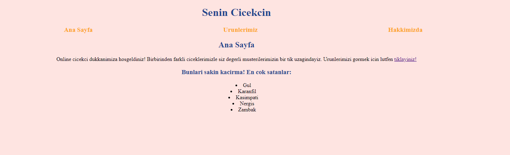

# Online cicekcilikten herkese merhaba!

## Buradaki beklentiniz ne olmalidir?
Başlangıç Seviye Frontend Web Development Patikası kapsaminda aldigim egitimde su ana kadar CSS hakkinda ogrendigim teorilerin, pratige dokulmus halidir.

***

## Nelerden yararlandim?
1. HTML
2. CSS
3. GIT ve GitHub
4. VS code

### Lutfen;

Eger bu projede goz gezdirip, daha farkli yapmam gerektigini dusundugunuz bir sey olursa diye belirtmek isterim ki, her turlu yoruma, elestiriye acigim. Ogrenmenin zamani ve yasi yoktur! :smile:
### [*patika.dev* profilime goz atmak icin;](https://app.patika.dev/nomad)

